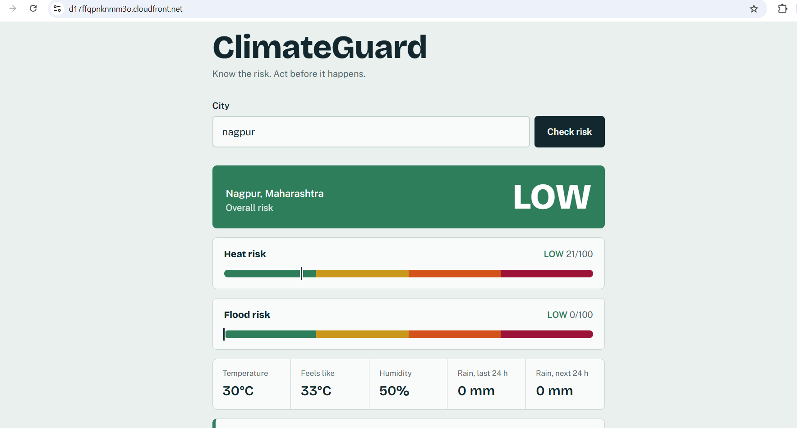
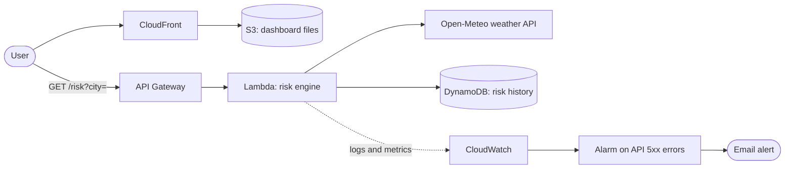
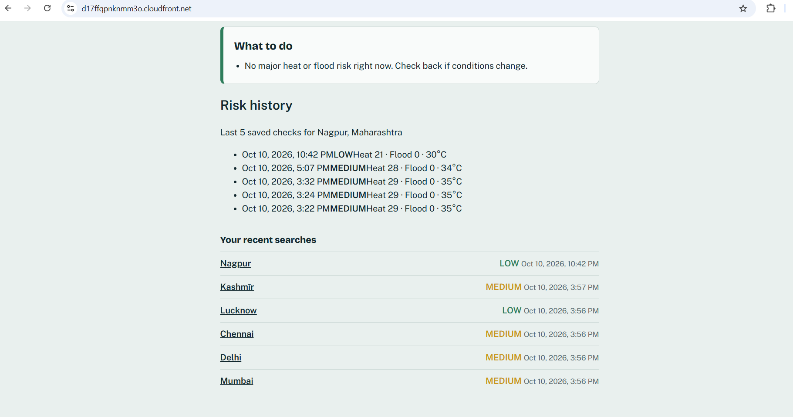
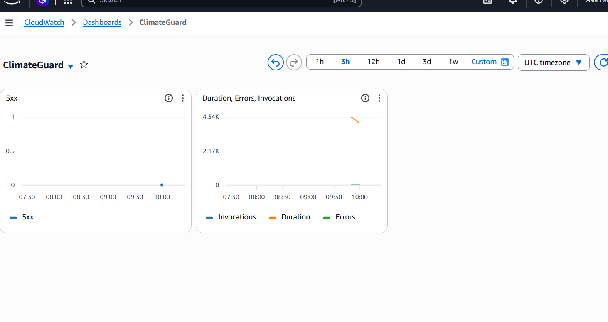
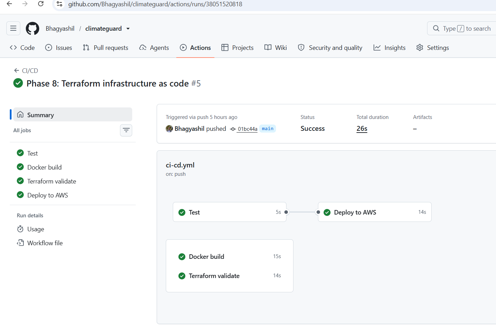

# ClimateGuard

**Know the risk. Act before it happens.**

ClimateGuard tells people whether their city has a heat or flood risk right now, scores it from 0 to 100, and says what to do about it. It is built for residents, outdoor workers and families who need a plain answer ("avoid outdoor activity 12 PM–4 PM") instead of a table of weather numbers.

**Live demo:** https://d17ffqpnknmm3o.cloudfront.net



## What it does

- Search any city and get its current **heat risk** and **flood risk**, each scored 0–100
- Overall level: **LOW / MEDIUM / HIGH / CRITICAL**
- Clear safety recommendations for the situation
- **Risk history** saved in AWS for each city, so you can see how risk changed over time

## How the risk is calculated

| Risk | Input | Score |
|------|-------|-------|
| Heat | "Feels like" temperature (already includes humidity) | 28 °C = 0, 50 °C = 100 |
| Flood | Rain in the last 24 h + half of the forecast rain for the next 24 h | 150 mm = 100 |

Levels: below 25 LOW, below 50 MEDIUM, below 75 HIGH, otherwise CRITICAL. The overall level is the higher of the two. Weather data comes from [Open-Meteo](https://open-meteo.com/).

> **Limitation:** the thresholds are reasoned starting values, not official warning criteria. ClimateGuard is guidance and does not replace advisories from the IMD or local authorities.

## Architecture



| AWS service | Role in ClimateGuard |
|-------------|----------------------|
| S3 + CloudFront | Host the dashboard privately and serve it over HTTPS |
| API Gateway (HTTP API) | Public `GET /risk` endpoint, rate-limited |
| Lambda (Node.js) | Fetches weather, calculates the scores, saves history |
| DynamoDB | Stores each check; rows expire automatically after 30 days (TTL) |
| CloudWatch | Logs, a dashboard, and an alarm that emails on server errors |
| IAM | Least-privilege roles (the Lambda can only read/write its own table) |

## DevOps

- **CI/CD (GitHub Actions):** every push runs the tests, builds the Docker image and validates the Terraform. A push to `main` then packages and updates the Lambda, syncs the website to S3 and clears the CloudFront cache. AWS access uses short-lived OIDC credentials, so no access keys are stored in GitHub.
- **Docker:** the image runs the test suite during the build, then serves the dashboard with nginx.
- **Terraform:** `infrastructure/terraform` describes the whole stack as code (22 resources) and is validated in CI. It uses its own name prefix so it never clashes with the live stack.
- **Tests:** unit tests for the risk engine and the Lambda handler, run offline with the network mocked.

## Run it locally

```
npm test          # run the tests
npm start         # serve on http://localhost:3000, then open /frontend/
```

Set `window.CLIMATEGUARD_API` in `frontend/config.js` to your API address to use the AWS backend. Leave it empty to run in local mode, where the browser fetches weather directly.

With Docker: `docker compose up --build`, then open http://localhost:8080.

## API

```
GET /risk?city=Nagpur
```
Returns the place, current weather, heat/flood scores and levels, recommendations, and the last 10 saved checks for that place.

## Project structure

```
backend/          risk-engine.js, handler.js (Lambda), history.js (DynamoDB), tests
frontend/         index.html, style.css, script.js, config.js
infrastructure/   Terraform
docker/           config used inside the container
.github/workflows CI/CD pipeline
```

## Screenshots

| Risk history | CloudWatch dashboard | CI/CD run |
|---|---|---|
|  |  |  |
